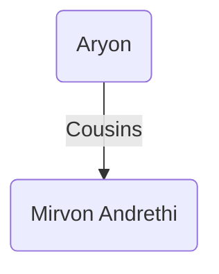

### [UESP](https://en.uesp.net/wiki/Morrowind:Mirvon_Andrethi)
**Mirvon Andrethi** is a [Dark Elf](https://en.uesp.net/wiki/Morrowind:Dark_Elf "Morrowind:Dark Elf") [monk](https://en.uesp.net/wiki/Morrowind:Monk_Service "Morrowind:Monk Service") located in the Services Tower in [[tel-vos|Tel Vos]].
### Modded
Mirvon is the Andrethi cousin of [[Aryon]] who is a student of the Marshmerrow society of martial artists as well as a fervent temple follower. [1]

> "The wisdom of the Ancestors cannot be rejected forever, friend. They speak of discipline and philosophy to me through their sacred bones. Likewise, I strengthen my own hallowed bones like the mighty marshmerrow. I can instruct you in the martial arts if you have the means."
> 
> "Atronach monarchs are unholy agents of Oblivion, %PCName. Aryon said that I should offer you free training, but instead I will give you something much more valuable. I will pray to Almsivi on your behalf. May the Three watch over you."
> -- Mirvon Andrethi (dialogue) [1]

### Quests
* The Domain of Living Fire [1]
	* Despite [[Aryon]]'s request to provide the player with free training, Mirvon will instead offer prayers for the player in their fight against the flame monarch.
### Source
1. [[oaab-grazelands|OAAB Grazelands]]