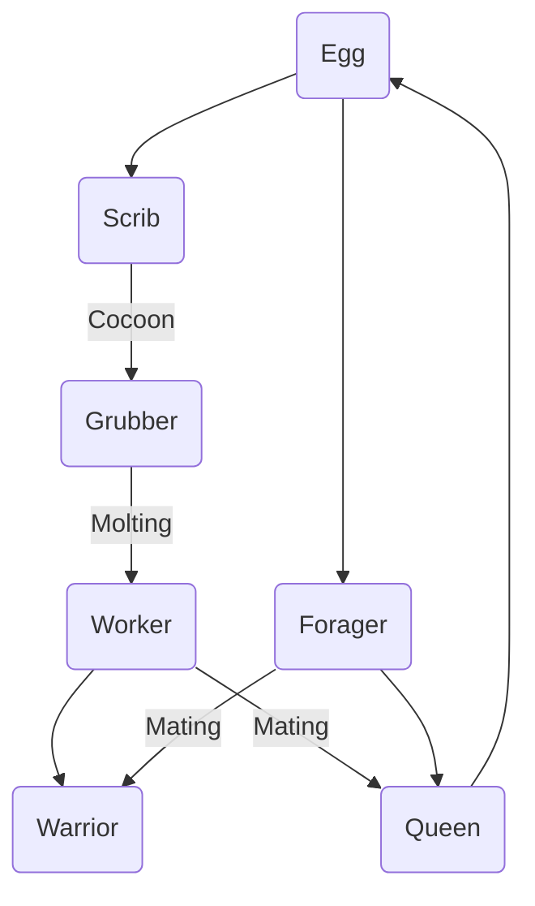

### Colony
> [!Quote]
> Kwama colonies, also known as eggmines, are home to the large creatures known as kwama. They are pock-marked with tunnels carved out by the foragers and workers. The former spray rock with acid to soften it, while the latter use their hard beaks to dig through the softened material. Egg miners must often use picks to widen tunnels too narrow to pass through in order to gather the precious kwama eggs.
> -- Egg Miner (dialogue)[^1]
### Eggs
> [!Quote]
> Kwama eggs are one of the most popular sources of protein in Morrowind. They stay fresh for a long time and their soft shells make them relatively easy to transport, which has made them popular throughout the Empire. Mind yourself around the eggs though, outlander. The mature ones will splash you with acid if you get too close. Look for the eggs that throb slightly. If you hear a scream: run.
> -- Egg Miner (dialogue)[^1]
### Forager
> [!Quote]
> The kwama forager scouts the surface of the land and natural underground passages, searching for suitable locations for new colonies, and hunting for prey. Foragers are aggressive but not very dangerous. When they return, they are often severely engorged with food for the colony. They will then be suspended in a place where they can provide nourishment to other kwama. I'd recommend avoiding any such foragers you see, lest you stimulate them to regurgitate their food onto yourself.
> -- Egg Miner (dialogue)[^1]
### Lifecycle

### Queen
> [!Quote]
> The kwama queen is the huge, bloated kwama that produces the colony's eggs and their meaty, blood-filled nests. The queens are too large and fat to move, and all their needs are attended by worker kwama.
> -- Egg Miner (dialogue)[^1]
### Scrib
> [!Quote]
> The scrib is a late larval form of the kwama. Towards the end of their life-cycle, scrib will encase themselves in a cocoon where they transform into either the male forager or female worker. The sharp tips of their legs secrete a mild paralyzing agent which they use to escape predators. Crushed scribs produce a nutritious but sour-tasting gelatin with modest magical properties that the natives eat with gusto.
> -- Egg Miner (dialogue)[^1]
### Acid
Kwama acid produced by kwama foragers to dig their tunnels and fight intruders gathers in pools in their colonies. The acid is particularly toxic for Telvanni mushroom roots.[^2]

> [!Quote]
> In the village, the roots break through walls with ease. But they seem weaker here in the egg mine. Some frail tendrils may break through the loose rock, but they quickly wither. I've noticed that the vapors coming from the poisonous acid pools are particularly capable at repelling the roots.
> -- Ibanu Zabbi (dialogue)[^2]

[^1]: [[oaab-data|OAAB_Data]]
[^2]: [[oaab-grazelands|OAAB Grazelands]]