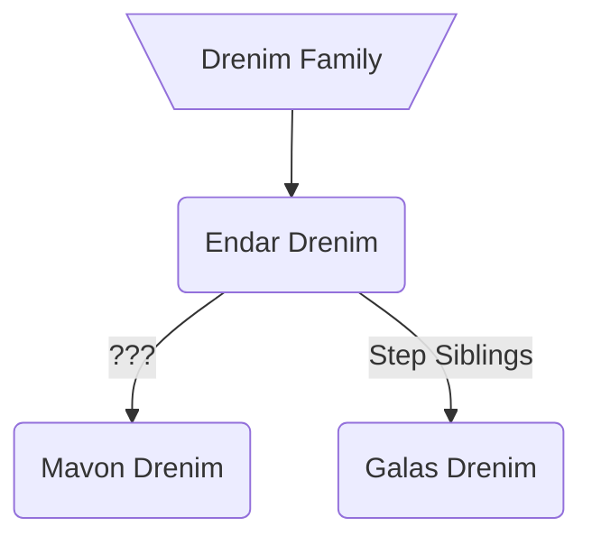

### [UESP](https://en.uesp.net/wiki/Morrowind:Tel_Naga#People)
### Modded
Endar Drenim is head spymaster for House Telvanni on Vvardenfell. He currently lives in Tel Naga, Sadrith Mora. He was instrumental in paving the way for the Grand Council vote on the [Mages Guild Monopoly](https://en.uesp.net/wiki/Morrowind:Mages_Guild_Monopoly) prior to the player's involvement. He is the stepbrother of [[galas-drenim|Galas Drenim]] and somehow related to Mavon Drenim as well. [1]

> [!Quote]
> Endar manages the Telvanni spy network here on Vvardenfell -- of course that isn't public knowledge and I trust you'll keep it to yourself. He's a dangerous man to make enemies with; as several assassins have learned who died by his blade or spell. He's currently living in Tel Naga, Sadrith Mora.
> -- [[galas-drenim|Galas Drenim]] (dialogue) [1]

Endar ultimately replaces [[dratha|Dratha]] as the Mage Lord of [[tel-mora|Tel Mora]]. [1]

### Quests
* A Monopoly on Spies [1]
	* Endar sends the player to assassinate [[chanil-lee|Chanil-Lee]] who he accuses of being a Mages Guild spy.
* An Illusion of Time [1]
	* Endar uses his theory of [[endars-influx|Endar's Influx]] to counter the vampire attacks on [[tel-mora|Tel Mora]].
* Master Endar [1] 🗺️
	* Endar thanks the player for their part in his elevation to Mage Lord of Tel Mora. The player has the option to provide Endar information about the [[geas]] which has now been transferred to him.
		* `PositionCell -257, -348, 1032, 16200, "Tel Mora, Upper Tower"`
### Source
1. [[oaab-tel-mora|OAAB Tel Mora]]