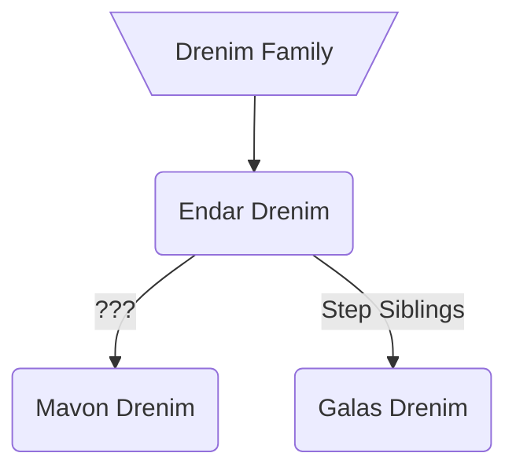

### [UESP](https://en.uesp.net/wiki/Morrowind:Galas_Drenim)
**Galas Drenim** is a [Dark Elf](https://en.uesp.net/wiki/Morrowind:Dark_Elf "Morrowind:Dark Elf") [sorcerer](https://en.uesp.net/wiki/Morrowind:Sorcerer "Morrowind:Sorcerer") and Wizard of [House Telvanni](https://en.uesp.net/wiki/Morrowind:House_Telvanni "Morrowind:House Telvanni") found in the Grand Council Chambers of [Ebonheart](https://en.uesp.net/wiki/Morrowind:Ebonheart "Morrowind:Ebonheart"). She is the current representative of House Telvanni in the Grand Council, the local legislature of the district of [Vvardenfell](https://en.uesp.net/wiki/Morrowind:Vvardenfell "Morrowind:Vvardenfell").
### Modded
Galas is stepsister of [[endar-drenim|Endar Drenim]].[^1]

### Quests
* A Monopoly on Spies[^1]
	* Tells the player about politics in Morrowind and directs them to her stepbrother, [[endar-drenim|Endar Drenim]] to learn about House Telvanni's spy network.

[^1]: [[oaab-tel-mora|OAAB Tel Mora]]