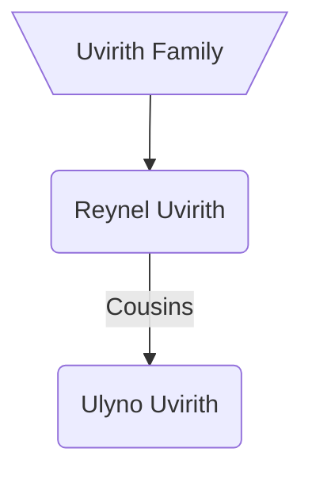

### [UESP](https://en.uesp.net/wiki/Morrowind:Reynel_Uvirith)
**Reynel Uvirith** is a [Dark Elf](https://en.uesp.net/wiki/Morrowind:Dark_Elf "Morrowind:Dark Elf") [mage](https://en.uesp.net/wiki/Morrowind:Mage_(class) "Morrowind:Mage (class)") and Wizard of [House Telvanni](https://en.uesp.net/wiki/Morrowind:House_Telvanni "Morrowind:House Telvanni") who will take up residence at [Tel Uvirith](https://en.uesp.net/wiki/Morrowind:Tel_Uvirith "Morrowind:Tel Uvirith") after you have built your stronghold for either [House Hlaalu](https://en.uesp.net/wiki/Morrowind:House_Hlaalu "Morrowind:House Hlaalu") or [House Redoran](https://en.uesp.net/wiki/Morrowind:House_Redoran "Morrowind:House Redoran") (she will not appear if you belong to House Telvanni). In either case, you will be instructed to kill her.

***
### Modded
Reynel is from Llothanis Heights on the mainland. If you join House Telvanni, Reynel Uvirith can instead be convinced to become [[aryon|Aryon]]'s new Mouth to replace Galos Mathendis and the player.[^1]

### Quests
* A New Mouth for Master Aryon[^1] <svg xmlns="http://www.w3.org/2000/svg" width="24" height="24" viewBox="0 0 24 24" fill="none" stroke="currentColor" stroke-width="2" stroke-linecap="round" stroke-linejoin="round" class="lucide lucide-pin"><path d="M12 17v5"/><path d="M9 10.76a2 2 0 0 1-1.11 1.79l-1.78.9A2 2 0 0 0 5 15.24V16a1 1 0 0 0 1 1h12a1 1 0 0 0 1-1v-.76a2 2 0 0 0-1.11-1.79l-1.78-.9A2 2 0 0 1 15 10.76V7a1 1 0 0 1 1-1 2 2 0 0 0 0-4H8a2 2 0 0 0 0 4 1 1 0 0 1 1 1z"/></svg>
	* Agrees to become [[aryon|Aryon]]'s new Mouth to replace the player.

[^1]: [[oaab-grazelands|OAAB Grazelands]]