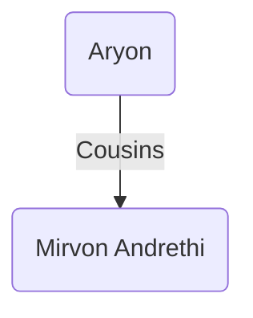

### [UESP](https://en.uesp.net/wiki/Morrowind:Aryon)
**Aryon** is a [Dark Elf](https://en.uesp.net/wiki/Morrowind:Dark_Elf "Morrowind:Dark Elf") [sorcerer](https://en.uesp.net/wiki/Morrowind:Sorcerer "Morrowind:Sorcerer") living in [[tel-vos|Tel Vos]]. He is a Master in [House Telvanni](https://en.uesp.net/wiki/Morrowind:House_Telvanni "Morrowind:House Telvanni") and appears to be the most fair and open-minded Councilor of the house. This is evident when looking at his tower which is something of an oddity even for a Telvanni: a Telvanni mushroom tower integrated into an [Imperial](https://en.uesp.net/wiki/Morrowind:Imperial "Morrowind:Imperial") castle. Somewhat isolated on a council of anti-Imperial isolationists and eccentrics, he is desperately looking [for new allies](https://en.uesp.net/wiki/Morrowind:Message_from_Master_Aryon "Morrowind:Message from Master Aryon"), be it his old mentor, [Divayth Fyr](https://en.uesp.net/wiki/Morrowind:Divayth_Fyr "Morrowind:Divayth Fyr"), or [Baladas Demnevanni](https://en.uesp.net/wiki/Morrowind:Baladas_Demnevanni_(person) "Morrowind:Baladas Demnevanni (person)"). [Smokey Morth](https://en.uesp.net/wiki/Morrowind:Smokey_Morth "Morrowind:Smokey Morth") has been saying - entirely correctly - he is doing so with the ultimate aim of usurping the [Archmagister](https://en.uesp.net/wiki/Morrowind:Gothren "Morrowind:Gothren"). However, once you yourself become powerful enough in House Telvanni, he will instead support your bid to replace the incumbent Archmagister. He is also rumored to have enchanted [a pair](https://en.uesp.net/wiki/Morrowind:Aryon%27s_Dominator "Morrowind:Aryon's Dominator") [of gloves](https://en.uesp.net/wiki/Morrowind:Aryon%27s_Helper "Morrowind:Aryon's Helper") in his youth with powerful conjuration spells.

During the [Telvanni Hortator](https://en.uesp.net/wiki/Morrowind:Telvanni_Hortator "Morrowind:Telvanni Hortator") part of the [Main Quest](https://en.uesp.net/wiki/Morrowind:Main_Quest "Morrowind:Main Quest"), Aryon understands the whole situation and immediately gives his vote for you to become Hortator of House Telvanni. He also offers advice on how to deal with the other Councilors. This is an example of his differences with the rest of House Telvanni, who are mainly concerned with slavery, artifacts, and their magickal studies.
### Modded
Aryon is cousins with [[mirvon-andrethi|Mirvon Andrethi]].

### Quests
* A Monopoly on Spies [1]
	* Aryon sends the player to [[galas-drenim|Galas Drenim]] after the mages guild monopoly quest to become more acquainted with politics.
* An Illusion of Time [1]
	* Aryon sends the player to [[endar-drenim|Endar Drenim]] to discuss how to deal with the vampire attacks on [[tel-mora|Tel Mora]].
* Vote of No Confidence [1]
	* Aryon sends the player to learn more about the [[geas]] which [[dratha|Dratha]] is protecting herself with and ultimately to assassinate Dratha.
* Master Endar [1]
	* Aryon sends the player to talk to [[endar-drenim|Endar Drenim]] about becoming the new Mage Lord of [[tel-mora|Tel Mora]].
* Conserving Water [2]
	* If the player shuts off the water supply to his conservatory in [[tel-vos|Tel Vos]], Aryon will become unhappy.
* Imitation is the Sincerest Form of Forgery [2]
	* Aryon asks the player to locate [[milyn-faram|Milyn Faram]]'s [[ideographer]] in Odirniran as he would like to acquire it.
* The Domain of Living Fire [2]
	* Aryon sends the player to kill the flame [[atronach-monarch|Atronach Monarch]] beneath [[tel-vos|Tel Vos]] in the caverns of Molaguradan.
* * A Smidge Too Far [2]
	* Aryon agrees to help the paralyzed Breton trader in [[tel-mora|Tel Mora]] and asks the player to fetch a potion of cure paralyzation so he can create a special cure.
### Source
1. [[oaab-tel-mora|OAAB Tel Mora]]
2. [[oaab-grazelands|OAAB Grazelands]]